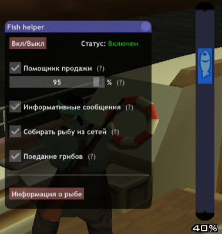

# 🎣 Скрипт для рыбалки (Samp-Rp)

## 📥 [**Скачать fish_helper.lua**](fish_helper.lua)

> Перенесите файл `fish_helper.lua` в папку `moonloader`.

  

---

## 🔧 Функции

- **Вкл/Выкл** — включает или выключает скрипт.
- **Автоматическая продажа** — автоматически начинает продажу рыбы в магазине, если цена рыбы **выше или равна** указанному порогу от максимальной цены.
  > Например: если максимальная цена Сома — `1000`, а в магазине она составляет `800` (80%), то для запуска продажи **необходимо** установить порог **не ниже 80%**.
- **Убрать волны** — убирает волны на воде
- **Кликер для сетей** — автоматически кликает по текстдравам рыб при сборе сети
- **Кликер для охоты** — автоматически кликает по поинтам при свежевании животного
- **Маркеры животных** — отображает маркеры животных на миникарте
- **Поедание грибов** — автоматически кушает грибы при сытности `= 0`
  > ⚠ Необходимо включить отображение сытности в интерфейсе игры. Отключается, если грибов нет
- **Информация о рыбе** — выводит полную информацию обо всей рыбе в чат (аналог `/fish journal`, но с ценами)

---

## ▶ Активация

Используй команду: `/fh`

## 📢 Связь

Подпишись на мой [канал](https://t.me/melvin_costra) чтобы быть в курсе обновлений!
